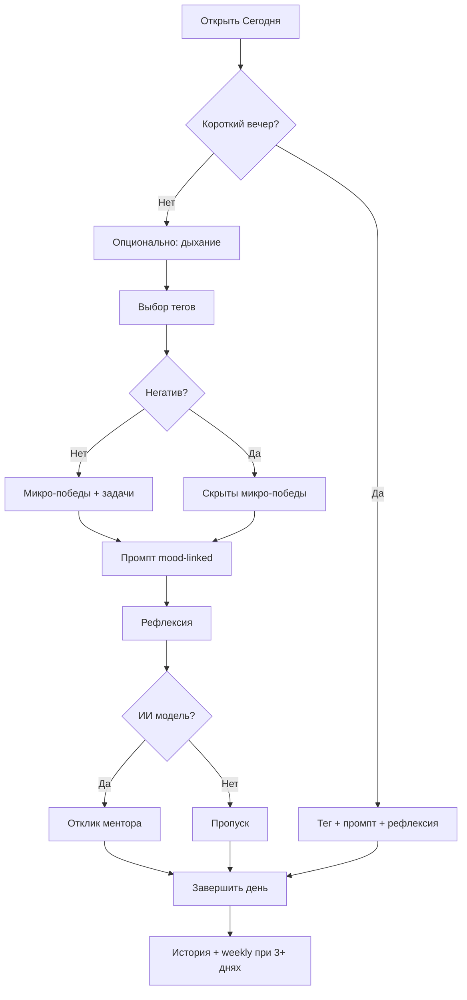
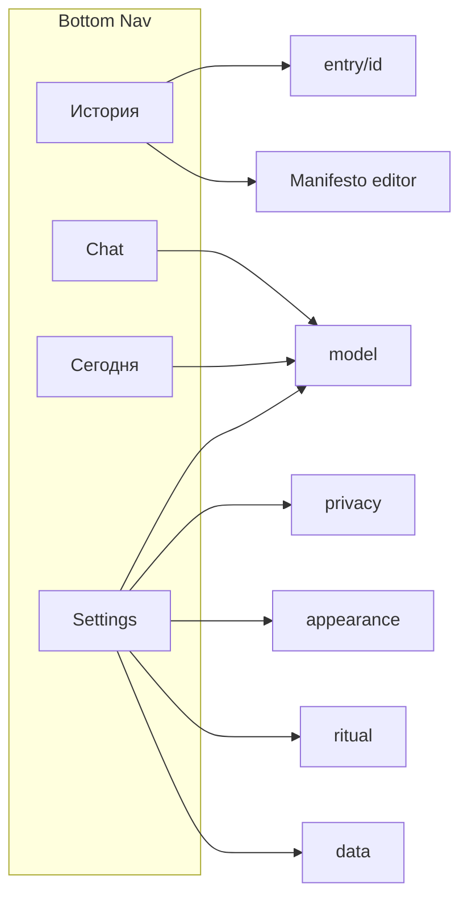

# Sanctum (PocketReflect) — руководство по ручной проверке

Документ составлен по актуальной кодовой базе. Предназначен для поэтапной проверки за **5–7 дней** (~30–60 минут в день).

---

## Как пользоваться

1. Соберите **globalDebug** на реальном устройстве (эмулятор — для части сценариев).
2. Отмечайте: ☐ не проверено · ✅ OK · ⚠️ баг · 📝 заметка.
3. В колонке **Ожидание** — эталонное поведение по коду.
4. Сначала **День 0** (подготовка), затем дни 1–7 по порядку или выборочно по блокам.
5. Для деструктивных тестов (wipe, import overwrite) используйте **отдельный профиль / второе устройство**.

### Рекомендуемое окружение

| Что | Зачем |
|-----|-------|
| Android 12+ | Splash Screen API, edge-to-edge |
| Устройство с биометрией | Замок, auto-lock |
| Устройство без биометрии | Fallback / недоступность замка |
| Файл модели `.litertlm` (E2B) | ИИ-ментор, чат, weekly trend |
| 2+ дня с тестовыми записями | История, поиск, weekly trend, time echo (см. подготовку) |

### Карта приложения

```
Запуск
 ├── DatabaseGate (если БД недоступна → восстановление)
 ├── BiometricGate (если замок включён)
 ├── WarmupGate (прогрев модели, не блокирует навсегда)
 └── 4 вкладки: Сегодня | История | Чат | Настройки
       ├── entry/{id}  ← из Истории / Time Echo
       └── settings/*  ← privacy, appearance, ritual, model, data
```

**Нижняя панель скрыта:** на подэкранах настроек, детали записи, при открытой клавиатуре.

---

## День 0 — Подготовка тестовых данных

| # | Действие | Ожидание |
|---|----------|----------|
| 0.1 | Чистая установка или wipe → первый запуск | Splash → главный экран «Итоги дня» |
| 0.2 | Сохранить **3 записи подряд** только с негативными тегами (тревога/грусть/раздражение) | Подготовка к «короткому вечеру» |
| 0.3 | Сохранить запись с **позитивными** тегами + микро-победы + 3 задачи + рефлексия | Полный ритуал в истории |
| 0.4 | Сохранить запись **~365 дней назад** (через выбор даты в календаре) | Подготовка к Time Echo |
| 0.5 | Записать **личные ориентиры** в Истории | Карточка + контекст ИИ |
| 0.6 | (Опционально) Подключить модель Gemma в Настройки → Модель | Статус ИИ «готов» на Сегодня/Чат |

---

## День 1 — Запуск, безопасность, навигация

### 1.1 Холодный старт и gates

| # | Шаги | Ожидание | ☐ |
|---|------|----------|---|
| 1.1.1 | Закрыть app из recents → открыть снова | Splash (фон + иконка) → Сегодня, без белой вспышки | |
| 1.1.2 | Включить **биометрический замок** (Настройки → Приватность) → свернуть app → открыть | Экран замка → системный BiometricPrompt / PIN | |
| 1.1.3 | Проверить таймауты auto-lock: **Сразу / 30 с / 1 мин / 5 мин** | После фона дольше таймаута — снова замок | |
| 1.1.4 | Отменить биометрию → «Повторить» на экране замка | Повторный запрос, app не падает | |
| 1.1.5 | С замком **выкл.** — cold start | Сразу контент, без BiometricGate | |

### 1.2 Защита экрана

| # | Шаги | Ожидание | ☐ |
|---|------|----------|---|
| 1.2.1 | Защита от скриншотов **вкл.** (по умолчанию) | Скриншот/recents — чёрный или пустой контент | |
| 1.2.2 | Выключить защиту → скриншот | Контент виден | |

### 1.3 Навигация

| # | Шаги | Ожидание | ☐ |
|---|------|----------|---|
| 1.3.1 | Переключить все 4 вкладки | Каждая открывается, состояние вкладок сохраняется | |
| 1.3.2 | История → запись → **Назад** | Возврат в ленту; bottom bar снова виден | |
| 1.3.3 | Настройки → любой подраздел → **Назад** | Bottom bar скрыт на подэкране, виден на хабе | |
| 1.3.4 | Сегодня → иконка статуса ИИ → переход к модели | Открывается settings/model | |
| 1.3.5 | Открыть клавиатуру на Сегодня/Чат | Bottom bar **скрывается** | |

### 1.4 Прогрев модели (WarmupGate)

| # | Шаги | Ожидание | ☐ |
|---|------|----------|---|
| 1.4.1 | Модель **не** подключена → запуск | Краткий blank/warmup → app работает без блокировки | |
| 1.4.2 | Модель подключена → cold start после reboot | Возможен экран прогрева (~30 с сообщение) → затем UI | |
| 1.4.3 | Журнал/история без модели | Сохранение записей работает; кнопки ИИ недоступны/со статусом offline | |

---

## День 2 — Вкладка «Сегодня»: базовый ритуал

### 2.1 Блок 1 — теги настроения

| # | Шаги | Ожидание | ☐ |
|---|------|----------|---|
| 2.1.1 | Не выбирать теги → «Завершить день» | Кнопка **неактивна**, подсказка «выберите тег» | |
| 2.1.2 | Выбрать 1+ тегов | Кнопка активна | |
| 2.1.3 | Мультивыбор: спокойствие + радость | Оба подсвечены | |
| 2.1.4 | Выбрать **негативный** тег | Блок «Микро-победы» **скрывается**; если текст был — очищается | |
| 2.1.5 | Снять негативный, вернуть позитивный | Микро-победы снова видны | |

### 2.2 Блоки 2–3 — микро-победы и задачи

| # | Шаги | Ожидание | ☐ |
|---|------|----------|---|
| 2.2.1 | Ввести микро-победы (полный режим) | Текст сохраняется | |
| 2.2.2 | Ввести **4+ строки** в «Фокус на завтра» | Предупреждение / error styling; при сохранении **обрезка до 3 строк** | |
| 2.2.3 | Пустые задачи | Мягкая подсказка (empathic hint), сохранение возможно | |

### 2.3 Блок 4 — промпт и рефлексия

| # | Шаги | Ожидание | ☐ |
|---|------|----------|---|
| 2.3.1 | Новый день, **без тегов** | Промпт из universal/fallback пула | |
| 2.3.2 | Выбрать **«Раздражение»**, все поля пустые | Промпт **меняется** на вопрос из пула раздражения (не случайный общий) | |
| 2.3.3 | Сменить на **«Сфокусированность»** (поля пустые) | Промпт меняется на другой контекст | |
| 2.3.4 | Начать писать рефлексию → сменить тег | Промпт **не меняется** | |
| 2.3.5 | «Дать другой» | Новый промпт из пула **текущего mood-контекста**; не повторяет недавние (FIFO ~7) | |
| 2.3.6 | Несколько тегов: негатив + позитив | Доминирует **негативный** пул (приоритет NEG > NEU > POS) | |

### 2.4 Сохранение

| # | Шаги | Ожидание | ☐ |
|---|------|----------|---|
| 2.4.1 | «Завершить день» с тегами | Баннер успеха ~3 с, haptic, зелёная точка «сохранено» | |
| 2.4.2 | Изменить запись **в тот же день** | Кнопка «Обновить запись»; промпт = сохранённый `promptShown` | |
| 2.4.3 | Календарь → **прошлый день** без записи | Пустая форма; промпт новый | |
| 2.4.4 | Прошлый день **с записью** | Поля заполнены; subtitle «редактирование прошлого дня» | |
| 2.4.5 | Time Echo / короткий вечер на **прошлых днях** | **Не** показываются | |

### 2.5 Шапка и диалоги

| # | Шаги | Ожидание | ☐ |
|---|------|----------|---|
| 2.5.1 | Тап по дате | Date picker (сегодня + прошлое, не будущее) | |
| 2.5.2 | Privacy badge | Диалог «всё на устройстве» | |
| 2.5.3 | Статус ИИ | Диалог статуса + ссылка на настройки модели | |

---

## День 3 — Ритуалы, дыхание, ИИ, Time Echo

### 3.1 Короткий вечер (Short Evening)

**Условие:** 3 **подряд** календарных дня (вчера, -2, -3) с записями, где **только** негативные теги.

| # | Шаги | Ожидание | ☐ |
|---|------|----------|---|
| 3.1.1 | Условие выполнено → открыть Сегодня | Баннер «тихий вечер»; скрыты дыхание, микро-победы, задачи | |
| 3.1.2 | «Развернуть полный ритуал» | Все блоки возвращаются до сохранения | |
| 3.1.3 | Сохранить в коротком режиме | Кнопка с короткой подписью («Закрыть вечер») | |

### 3.2 Дыхательный мост

| # | Шаги | Oжидание | ☐ |
|---|------|----------|---|
| 3.2.1 | «Начать» на карточке дыхания | Полноэкранная сессия, фазы вдох/выдох | |
| 3.2.2 | Настройки → Вечерний ритуал: **резонансное / квадрат**, 4/6/8 циклов | Сессия соответствует настройкам | |
| 3.2.3 | Вибрация вкл., интенсивность мягко/умеренно (только резонанс) | Импульсы на фазах | |
| 3.2.4 | Завершить сессию | Текст «готовы встретиться с мыслями…» | |

### 3.3 ИИ-ментор (нужна модель)

| # | Шаги | Ожидание | ☐ |
|---|------|----------|---|
| 3.3.1 | Без тегов | Запрос недоступен, подсказка | |
| 3.3.2 | С тегами → «Получить отклик» | Индикатор «формирует отклик…» → текст | |
| 3.3.3 | Негативный тег | Supportive mode (другой тон карточки) | |
| 3.3.4 | Сменить тег после отклика | Отклик **сбрасывается** | |
| 3.3.5 | Ориентиры вкл. в Истории | Отклик учитывает manifesto (качественно) | |
| 3.3.6 | «Обновить отклик» | Новая генерация | |

### 3.4 Недельный тренд

| # | Шаги | Ожидание | ☐ |
|---|------|----------|---|
| 3.4.1 | < 3 записей за 7 дней | Кнопка недоступна, hint «нужно больше записей» | |
| 3.4.2 | ≥ 3 записей → запрос | Сводка появляется; повтор = «Обновить» | |
| 3.4.3 | Ориентиры для weekly **выкл.** / **вкл.** | Различие в содержании (если модель подключена) | |

### 3.5 Time Echo

| # | Шаги | Ожидание | ☐ |
|---|------|----------|---|
| 3.5.1 | Есть запись ~год назад ±1 день | Карточка «год назад вы писали» | |
| 3.5.2 | Тап по карточке | Деталь записи | |
| 3.5.3 | Закрыть (X) | Карточка скрыта **~20 часов** | |
| 3.5.4 | После dismiss — перезапуск в тот же день | Карточка не показывается | |

### 3.6 Своё поле (custom journal field)

| # | Шаги | Ожидание | ☐ |
|---|------|----------|---|
| 3.6.1 | Настройки → задать вопрос + вкл. переключатель | Блок на Сегодня с вашим вопросом | |
| 3.6.2 | Вкл. без вопроса | Snackbar/блокировка | |
| 3.6.3 | Сохранить → История → деталь | Вопрос + ответ видны | |

---

## День 4 — История, поиск, ориентиры

### 4.1 Лента и заголовки месяцев

| # | Шаги | Ожидание | ☐ |
|---|------|----------|---|
| 4.1.1 | Открыть Историю | Записи по месяцам, sticky headers | |
| 4.1.2 | Под названием месяца | Строка **Top-3 тегов**: `Тег (N) • …`, нейтральный цвет | |
| 4.1.3 | Месяц без тегов | Строка статистики **скрыта** | |
| 4.1.4 | Сворачивание месяца (chevron) | Записи скрываются/раскрываются | |
| 4.1.5 | Карточка записи | Дата, теги, превью (без текста ИИ в превью) | |

### 4.2 Поиск

| # | Шаги | Ожидание | ☐ |
|---|------|----------|---|
| 4.2.1 | 1 символ в поиске | Фильтр **не** активен (полная лента) | |
| 4.2.2 | ≥ 2 символов, слово из рефлексии | Только совпадения; «Найдено: N» | |
| 4.2.3 | Поиск по тегу («тревога») | Находит записи с этим тегом | |
| 4.2.4 | Нет результатов | «Совпадений нет» + empty state | |
| 4.2.5 | Активный поиск | Карточка **личных ориентиров скрыта**; месяцы **развёрнуты** | |
| 4.2.6 | Очистить (X) | Полная лента, ориентиры снова видны | |
| 4.2.7 | Превью в результатах | Строка с **совпадением**, если возможно | |

### 4.3 Личные ориентиры

| # | Шаги | Ожидание | ☐ |
|---|------|----------|---|
| 4.3.1 | Тап по карточке | Полноэкранный редактор | |
| 4.3.2 | Сохранить текст | Snackbar «сохранено»; карточка «настроено» | |
| 4.3.3 | Переключатели «ментор» / «недельный тренд» | Работают только при непустом тексте | |
| 4.3.4 | По умолчанию после установки | Оба переключателя **выкл.** | |

### 4.4 Деталь записи

| # | Шаги | Ожидание | ☐ |
|---|------|----------|---|
| 4.4.1 | Все секции с данными | Теги, микро-победы, задачи, промпт, рефлексия, отклик ИИ | |
| 4.4.2 | Пустые секции | Не показываются (кроме тегов/промпта) | |
| 4.4.3 | «Удалить запись» → подтвердить | **Один** диалог → удаление → возврат в историю | |
| 4.4.4 | Отмена удаления | Запись на месте | |

---

## День 5 — Чат

### 5.1 Первый вход

| # | Шаги | Ожидание | ☐ |
|---|------|----------|---|
| 5.1.1 | Чат первый раз | Полноэкранный **дисклеймер** | |
| 5.1.2 | Без галочки | «Продолжить» неактивна | |
| 5.1.3 | Принять | Список сообщений / empty state | |

### 5.2 Отправка и стриминг

| # | Шаги | Ожидание | ☐ |
|---|------|----------|---|
| 5.2.1 | Пустое сообщение | Отправка недоступна | |
| 5.2.2 | Отправить вопрос (модель подключена) | Стриминг ответа; кнопка отмены | |
| 5.2.3 | Отменить стриминг | Частичный ответ сохраняется | |
| 5.2.4 | Без модели | Понятный статус offline / fallback | |

### 5.3 Персона и контекст

| # | Шаги | Ожидание | ☐ |
|---|------|----------|---|
| 5.3.1 | Chip персоны → bottom sheet | 4 архетипа: Бережный проводник, Честное зеркало, Реалист-прагматик, Тихий слушатель | |
| 5.3.2 | Сменить персону | **Отдельная** история сообщений на персону | |
| 5.3.3 | «Учитывать дневник» + 1/3/7 дней | Контекст в промпте (качественно) | |
| 5.3.4 | «Учитывать ориентиры» | Manifesto в контексте | |
| 5.3.5 | Индикатор контекста % | Растёт с длиной чата; progress bar | |

### 5.4 Переполнение и очистка

| # | Шаги | Ожидание | ☐ |
|---|------|----------|---|
| 5.4.1 | Длинный диалог → ~100% контекста | Баннер «контекст заполнен»; отправка **заблокирована** | |
| 5.4.2 | «Сжать» | Саммари одним сообщением; история очищена | |
| 5.4.3 | Иконка корзины → подтверждение | Очистка **текущей** персоны | |

---

## День 6 — Настройки

### 6.1 Хаб

| # | Шаги | Ожидание | ☐ |
|---|------|----------|---|
| 6.1.1 | Блок поддержки | «Почему бесплатный?» раскрывается; кнопки сайт / GitHub | |
| 6.1.2 | 5 разделов | Privacy, Appearance, Ritual, Model, Data — summary в строке | |

### 6.2 Приватность и безопасность

| # | Шаги | Ожидание | ☐ |
|---|------|----------|---|
| 6.2.1 | «Подробнее о приватности» | Текст соответствует **реальным** разрешениям (vibration, biometric, WorkManager; **без** push/audio) | |
| 6.2.2 | Wipe: диалог 1 → диалог 2 | Ввести **`стереть`** / **`erase`** → подтвердить | |
| 6.2.3 | После wipe | Пустая история; prefs сброшены; app не падает | |

### 6.3 Внешний вид

| # | Шаги | Ожидание | ☐ |
|---|------|----------|---|
| 6.3.1 | Тёмная / светлая тема | Мгновенное применение | |
| 6.3.2 | Язык: RU / EN / системный | Перезапуск/recreate; строки на выбранном языке | |
| 6.3.3 | Тактильная отдача UI (haptic) | Вкл/выкл сохраняется | |
| 6.3.4 | Карточка «Философия» | Диалог с 4 секциями читается без обрезки | |

### 6.4 Вечерний ритуал

| # | Шаги | Ожидание | ☐ |
|---|------|----------|---|
| 6.4.1 | Режим дыхания | Две карточки: резонансное / классический квадрат — **полные** названия + detail | |
| 6.4.2 | Циклы 4 / 6 / 8 | Chip selection | |
| 6.4.3 | Custom field | Вопрос, подсказка, toggle | |

### 6.5 Модель ИИ

| # | Шаги | Ожидание | ☐ |
|---|------|----------|---|
| 6.5.1 | GPU / CPU toggle | Сохраняется | |
| 6.5.2 | Attach E2B через SAF | Прогресс → карточка «подключена» | |
| 6.5.3 | Неверный файл | Ошибка верификации SHA | |
| 6.5.4 | Заменить / удалить | Detach dialog; статус offline после удаления | |

### 6.6 Данные

| # | Шаги | Ожидание | ☐ |
|---|------|----------|---|
| 6.6.1 | **Backup** export `.sanctum` | Пароль + подтверждение → файл создан | |
| 6.6.2 | Backup import | Восстановление записей; опция overwrite | |
| 6.6.3 | **Vault** export ZIP (без шифрования) | Файл открывается / содержит данные | |
| 6.6.4 | Vault export encrypted | `.sanctum-vault` | |
| 6.6.5 | Vault import | Записи появляются в истории | |
| 6.6.6 | Toggles: weekly profiles, manifesto in export | Влияют на состав архива | |

---

## День 7 — Краевые случаи и регрессия

### 7.1 Жизненный цикл

| # | Шаги | Ожидание | ☐ |
|---|------|----------|---|
| 7.1.1 | Rotate во время дыхания / чата / редактора ориентиров | Состояние сохраняется | |
| 7.1.2 | Process death: заполнить рефлексию → kill app → reopen | Черновик **может** потеряться (зафиксируйте фактическое поведение) | |
| 7.1.3 | Смена языка во время ввода | Нет краша; строки обновились | |

### 7.2 Связки между экранами

| # | Сценарий | Ожидание | ☐ |
|---|----------|----------|---|
| 7.2.1 | Запись на Сегодня → История → деталь | Данные совпадают | |
| 7.2.2 | Удалить в детали → вернуться | Запись исчезла из ленты и поиска | |
| 7.2.3 | Wipe → попытка открыть старый deep link entry | Empty / not found | |
| 7.2.4 | Import backup поверх данных | Overwrite on/off работает предсказуемо | |

### 7.3 Offline / privacy инварианты

| # | Проверка | Ожидание | ☐ |
|---|----------|----------|---|
| 7.3.1 | Airplane mode на всё время | App полностью функционален (кроме внешних ссылок support) | |
| 7.3.2 | Нет permission INTERNET в manifest | Подтвердить через App Info / aapt | |

### 7.4 База данных недоступна (редко)

| # | Шаги | Ожидание | ☐ |
|---|------|----------|---|
| 7.4.1 | Экран DatabaseUnavailable (если воспроизводимо) | Import backup **или** start fresh; **без** биометрии | |

---

## Матрица «функция → где проверять»

| Функция | Основной экран | Связанные экраны |
|---------|----------------|------------------|
| Mood-linked промпт | Сегодня §2.3 | История (promptShown в детали) |
| Короткий вечер | Сегодня §3.1 | — |
| Дыхание | Сегодня §3.2 | Настройки → Ritual |
| ИИ-ментор | Сегодня §3.3 | Model settings; manifesto toggles |
| Weekly trend | Сегодня §3.4 | Manifesto toggle |
| Time Echo | Сегодня §3.5 | Entry detail |
| Поиск истории | История §4.2 | — |
| Top-3 тегов/месяц | История §4.1 | — |
| Личные ориентиры | История §4.3 | Chat context; AI mentor |
| Чат + персоны | Чат §5 | Model settings |
| Backup / Vault | Data §6.6 | Database recovery |
| Биометрия / wipe | Privacy §6.2 | Day 1 |

---

## Диаграмма: вечерний поток (happy path)



---

## Диаграмма: навигация



---

## Известные особенности (не путать с багами)

| # | Поведение | Комментарий |
|---|-----------|-------------|
| 1 | Удаление записи — **один** диалог | В ViewModel `ConfirmFirstStep` сразу удаляет |
| 2 | Виджет «вчера» | Layout/strings есть; **receiver не в manifest** — не тестировать как shipped feature |
| 3 | Промпт при смене тега | Только если reflection, tasks, custom, micro-wins **все пустые** |
| 4 | `values-en` vs `values` | Основные локали: `values` (EN) + `values-ru` (RU) |
| 5 | Warmup Failed | Не блокирует UI; возможен mock/fallback |

---

## Журнал находок (заполняйте по ходу)

| ID | День | Severity | Экран | Описание | Статус |
|----|------|----------|-------|----------|--------|
| B-001 | | Critical / Major / Minor | | | Open / Fixed |
| B-002 | | | | | |

---

## Быстрый smoke (15 минут)

Если нужна минимальная проверка перед релизом:

1. ☐ Cold start + 4 вкладки  
2. ☐ Сохранить день с тегом  
3. ☐ Mood prompt меняется при выборе тега (поля пустые)  
4. ☐ История: поиск + top-3 тегов  
5. ☐ Чат: disclaimer + 1 сообщение  
6. ☐ Настройки: theme + language toggle  
7. ☐ Model attach (если есть файл)  
8. ☐ Biometric lock on/off  

---

*Версия документа: составлено по codebase Sanctum / PocketReflect. При изменении логики обновляйте соответствующие секции.*
